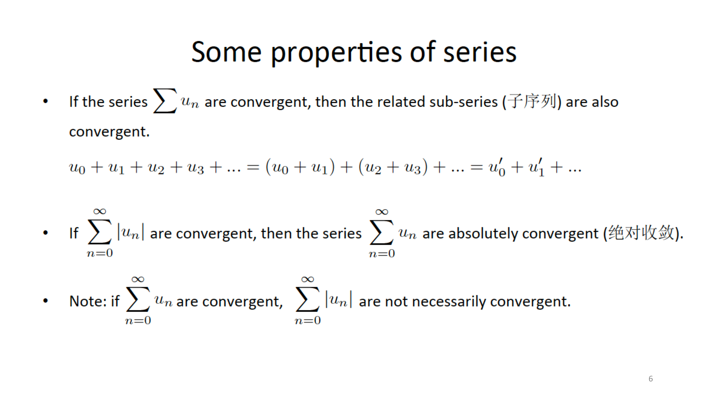
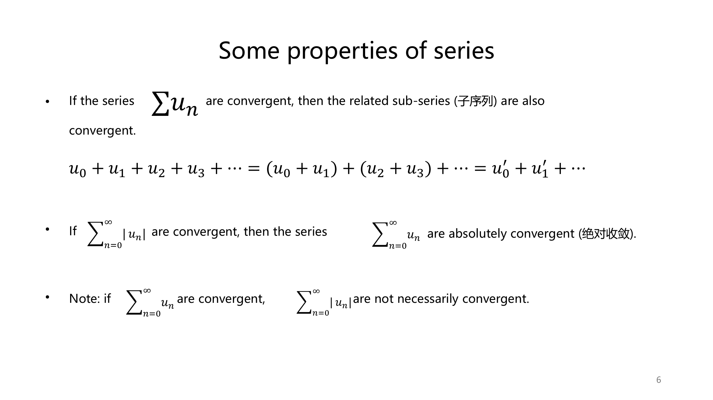
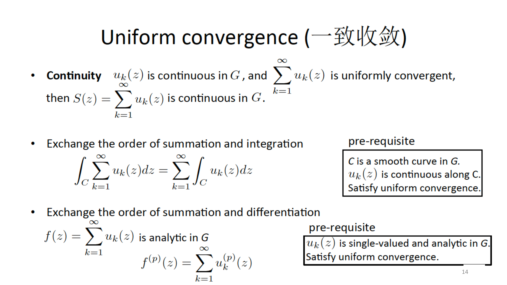
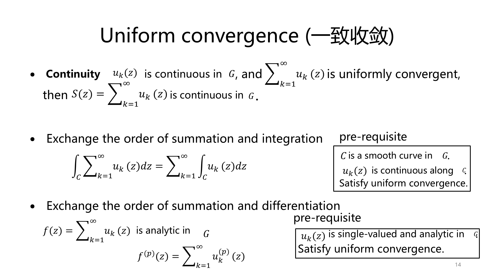
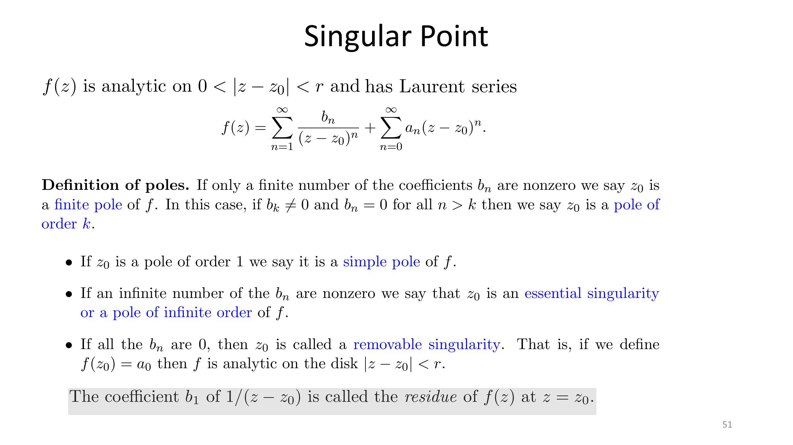
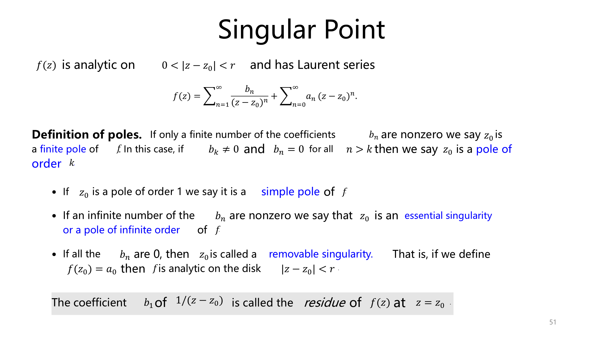

<p align="center"></p>

<h1 align="center">PPT Rebuild</h1>

<p align="center"><strong>PDF 课件 → 公式可编辑的高保真 PowerPoint</strong></p>

把现有 PDF 课件复刻成真正可修改的 PowerPoint，尤其擅长公式密集页面。

文字是文本框，公式是 PowerPoint 原生公式；需要保持原貌的图、照片和二维码从原 PDF 裁取为独立对象。目标是尽可能贴近原稿，同时保留后续修改能力，而不是把整页截图塞进 `.pptx`。

> 只需安装 **PPT Rebuild 这一份 skill**。逐页重建工具、页面规则、公式转换与校准脚本都在本目录；无需再安装 `image-to-editable-ppt` 或 `codex-ppt`。运行时仍需要 Python 依赖，完整公式视觉校准需要 Windows 桌面版 PowerPoint。

## 实际效果

下面是同一份 56 页复变函数讲义的原 PDF 与最终 PPT 对照。右侧页面由文本、原生公式和必要的独立图片对象重建，不是整页原图叠加隐藏文字。点击图片可查看大图。

### 行内求和与正文对齐

| 原 PDF · 第 6 页 | 可编辑 PPT · 第 6 页 |
| --- | --- |
|  |  |

### 积分、求和与占位方框修复

原生 Office 公式如果结构不完整，求和/积分内部会显示虚线小方框。本流程会检查这类空结构，并在交付前按源页校准公式可见大小与位置。

| 原 PDF · 第 14 页 | 可编辑 PPT · 第 14 页 |
| --- | --- |
|  |  |

### 紧凑分式和长段落混排

行内的 `1/(z-z₀)` 保持紧凑阅读形态；不会为了“公式化”机械改成撑高整行的上下分式。

| 原 PDF · 第 51 页 | 可编辑 PPT · 第 51 页 |
| --- | --- |
|  |  |

这份已完成样例共有 **56 页、384 个原生 Office 公式**；最终文件结构审计中，空求和/积分主体为 **0**。这是具体案例，不是对任意 PDF 的自动效果保证。示例图来自用户提供的讲义，正式公开发布前请确认展示授权或替换为可公开素材。

## 核心能力

- **公式是可编辑对象**：从源页核对 LaTeX，最终写入 Office Math（OMML），可在 PowerPoint 的公式编辑器内修改变量、上下标、分式与求和结构。
- **公式和文字看起来要匹配**：不只设置相同磅值，而是对比 PDF 原页和 PowerPoint 渲染的实际字形，校准公式尺寸、位置、行内基线和词间距。
- **主动检查常见坏结果**：审计虚线空方框、公式/文字碰撞、紧贴的词间距、宽公式溢出，以及行内小公式悬浮或下沉。
- **原图忠实保留**：按需直接提取或裁取原 PDF 的图、徽标和二维码，记录来源页与裁切范围；不把用户要求“原样”的视觉素材重新生成。
- **完整可恢复的逐页流程**：页面重建、对象清单、验证、整套组装、原生公式转换和最终逐页对照都在同一个 skill 内。支持页面 worker 并行；没有 worker 时也能逐页本地推进。

| 内容 | 交付后的编辑方式 |
| --- | --- |
| 标题、正文、页码 | 文本框，可改字、字号、颜色与位置；可按需求用微软雅黑 |
| 已转换的公式 | PowerPoint 原生公式，可改数学结构 |
| 简单线条、形状、常规表格 | 优先用 PowerPoint 原生对象 |
| 原 PDF 图、照片、二维码 | 可移动、缩放、裁切、替换；图内像素**不能**逐笔编辑 |

公式通常由 Office 的 Cambria Math 渲染，正文可以是微软雅黑；本 skill 对齐的是**可见字号与基线**，不会把数学字体错误地标成微软雅黑。复杂页面不保证逐像素相同，PDF 字体与 Office 重排可能留下细微差异。

## 安装

把下面这句话发给 Codex：

> 请帮我安装 **ppt-rebuild** 这个 skill，地址是：https://github.com/Enei7/ppt-rebuild-skills 。`SKILL.md` 在仓库根目录。

安装后输入 `$ppt-rebuild` 使用；如果技能列表没有刷新，重启 Codex。无需安装其他两个 PPT skill，也无需手动复制目录或运行 `pip` 命令。

首次转换时，skill 会检查运行环境，并在需要时安装自带 CLI 的 Python 依赖。运行需要 Python 3.10 或更新版本；完整的公式尺寸和基线校准还需要 Windows 桌面版 PowerPoint。百度 PaddleOCR Token 可选，不提供也可以离线继续。不要将 API key、OCR Token 或讲义原件提交到公开仓库。

## 使用

```text
$ppt-rebuild 请把 lecture5.pdf 复刻为可编辑 PPT：
正文用微软雅黑，所有关键公式都要能在 PowerPoint 中编辑；
原图和二维码直接取自 PDF，并逐页检查公式与文字的大小、基线和间距。
```

流程是：检查源 PDF → 逐页拆解文本/结构/原图及公式 → 组装 PPT → 转换原生公式 → 对照源页校准 → 整套渲染和审计。可编辑文字与公式是主要目标；无法辨认的源符号必须人工核实，不能让 OCR 猜。详细规则见 [`SKILL.md`](SKILL.md)，命令与对象契约见 [`references/`](references/)。

## 交付标准与局限

交付时核对 PDF/PPT 页数与顺序、正文和必要图像是否齐全、公式是否能进入编辑器、是否有空方框/溢出/压字/错位、二维码是否清楚。结构检查不能代替逐页目视检查。若公式转换、Office 校准或原图来源证明失败，应说明阻塞或未完成项，不把中间文件称作“最终可编辑版”。

## 致谢与许可

项目作者与维护者：[Enei7](https://github.com/Enei7)。

本项目打包并改造了 [ningzimu/image-to-editable-ppt-skill](https://github.com/ningzimu/image-to-editable-ppt-skill) 的 `editppt` 运行时与逐页重建流程；感谢其开源工作，并在 [`THIRD_PARTY_LICENSES.md`](THIRD_PARTY_LICENSES.md) 保留原 MIT 许可和版权声明。也感谢 [ningzimu/codex-ppt-skill](https://github.com/ningzimu/codex-ppt-skill) 对阶段化流程和 PPT 验收展示的启发。致谢不代表安装依赖：用户只安装 PPT Rebuild 即可。
